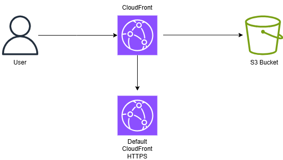
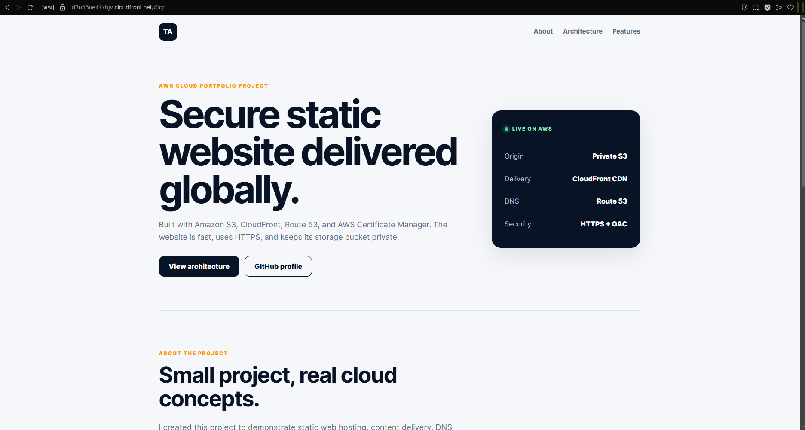
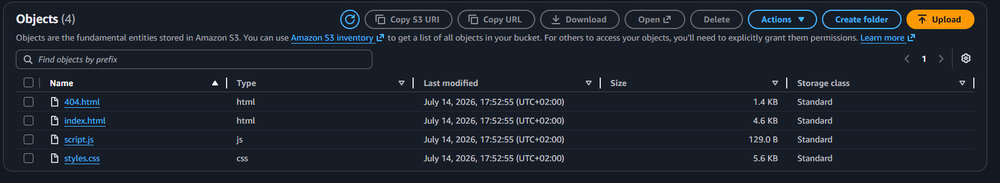

# Secure Static Website on AWS

A static portfolio website hosted in a private Amazon S3 bucket and delivered globally through Amazon CloudFront.

The project demonstrates secure origin access, HTTPS delivery, edge caching, custom error handling, and practical AWS deployment documentation.

## Live Website

[Open the deployed website](https://d3u56ueif7xbjv.cloudfront.net)

Replace the URL above with your real CloudFront distribution URL.

## Architecture



### Request flow

1. A visitor opens the CloudFront URL.
2. CloudFront redirects HTTP requests to HTTPS.
3. CloudFront checks whether the requested file is already cached.
4. If the file is not cached, CloudFront requests it from Amazon S3.
5. Origin Access Control signs the request to S3.
6. The private S3 bucket returns the requested object to CloudFront.
7. CloudFront caches and delivers the object to the visitor.

## AWS Services Used

| Service | Purpose |
| --- | --- |
| Amazon S3 | Stores the HTML, CSS, JavaScript, and error-page files |
| Amazon CloudFront | Delivers the website through a global content delivery network |
| Origin Access Control | Allows only the CloudFront distribution to access the private S3 objects |
| CloudFront HTTPS | Encrypts traffic using the default CloudFront certificate |

## Security Configuration

The S3 bucket is not publicly accessible.

The following security settings were implemented:

- S3 Block Public Access enabled
- ACLs disabled
- Bucket owner enforced
- CloudFront Origin Access Control enabled
- Bucket policy restricted to the CloudFront distribution
- HTTP requests redirected to HTTPS
- Only `GET` and `HEAD` methods allowed
- No AWS credentials stored in the repository

## Website Files

```text
.
├── index.html
├── styles.css
├── script.js
├── 404.html
├── docs/
│   └── architecture.png
└── screenshots/
```

### File descriptions

- `index.html` contains the main website structure and content.
- `styles.css` contains the visual design and responsive layout.
- `script.js` contains the small client-side functionality.
- `404.html` is the custom missing-page response.
- `docs/architecture.png` shows the AWS architecture.
- `screenshots/` contains implementation evidence from the AWS Console.

## Deployment Process

### 1. Create the S3 bucket

I created an Amazon S3 bucket and uploaded the website files directly to the bucket root.

The following files were uploaded:

```text
index.html
styles.css
script.js
404.html
```

S3 Block Public Access remained enabled.

### 2. Create the CloudFront distribution

I created a CloudFront distribution and selected the S3 bucket as the origin.

The distribution was configured with:

- Origin Access Control
- Signed requests using AWS Signature Version 4
- HTTP-to-HTTPS redirection
- `GET` and `HEAD` methods
- CloudFront caching
- `index.html` as the default root object

### 3. Restrict S3 access

The S3 bucket policy grants `s3:GetObject` permission to the CloudFront service principal.

The policy is restricted to the specific CloudFront distribution using the distribution ARN.

This means visitors cannot access the S3 files directly. They must access the website through CloudFront.

### 4. Configure error handling

A custom `404.html` page was added.

CloudFront can return this page when a requested file does not exist.

### 5. Verify the deployment

The deployment was tested using the CloudFront distribution domain.

I verified:

- The homepage loads successfully
- CSS and JavaScript files load correctly
- HTTPS is enabled
- HTTP redirects to HTTPS
- S3 remains private
- CloudFront can retrieve files through Origin Access Control

## Implementation Evidence

### Live website



### S3 objects



### Private S3 Policy


### CloudFront distribution


### CloudFront origin and OAC


### CloudFront cache behaviour


## Custom Domain Status

The current deployment uses the default CloudFront domain and CloudFront HTTPS certificate.

A custom domain was designed as a future extension using:

```text
Visitor → Route 53 → CloudFront → Private S3 bucket
```

The future implementation would include:

- Domain registration
- Route 53 public hosted zone
- ACM public certificate in `us-east-1`
- Route 53 alias records pointing to CloudFront
- Custom domain added to the CloudFront distribution

Route 53 and the custom ACM certificate are documented as a planned extension and were not deployed in the current version.

## What I Learned

This project helped me practise:

- Creating and configuring an S3 bucket
- Understanding public and private S3 access
- Creating a CloudFront distribution
- Connecting CloudFront to an S3 origin
- Configuring Origin Access Control
- Writing and applying a restricted bucket policy
- Configuring HTTPS redirection
- Understanding CDN caching
- Documenting cloud infrastructure
- Separating implemented features from planned improvements

## Future Improvements

- Add a custom domain using Route 53
- Add an ACM certificate for the custom domain
- Automate deployment using GitHub Actions
- Define the infrastructure using Terraform or CloudFormation
- Enable CloudFront access logging
- Add cache-control headers to static assets
